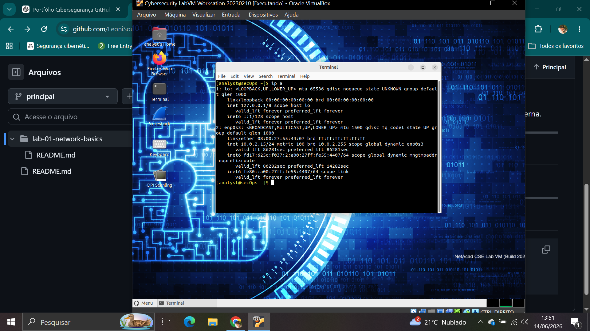

# 🧪 LAB 01 – Network Basics (SOC Foundation)

## 🎯 Objetivo
Entender conceitos básicos de rede em Linux e verificar conectividade, rota e comunicação externa.

---

## 🛠️ Ferramentas utilizadas
- Terminal Linux

---

## 💻 Comandos executados

```bash
ip a
arp -a
ping -c 4 8.8.8.8
ip route

## 📸 Evidências

### Configuração de Rede



### Tabela ARP


### Teste de Conectividade


### Tabela de Rotas


