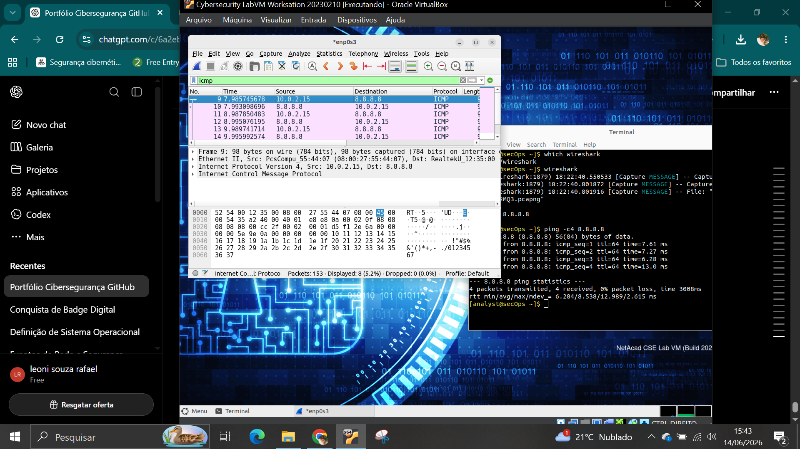
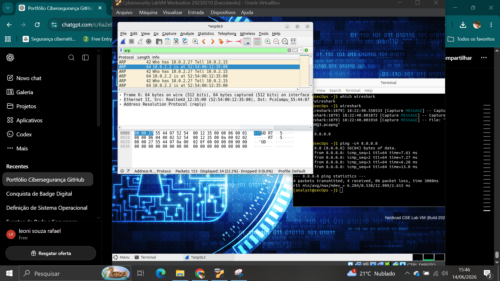
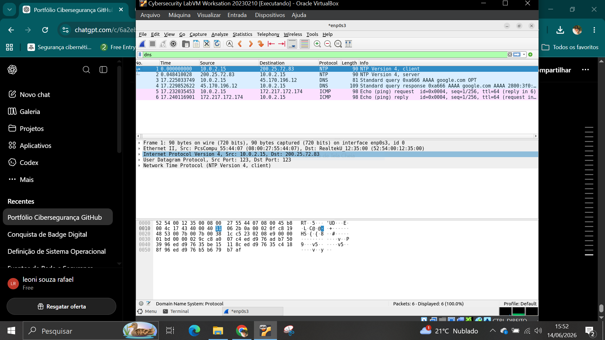
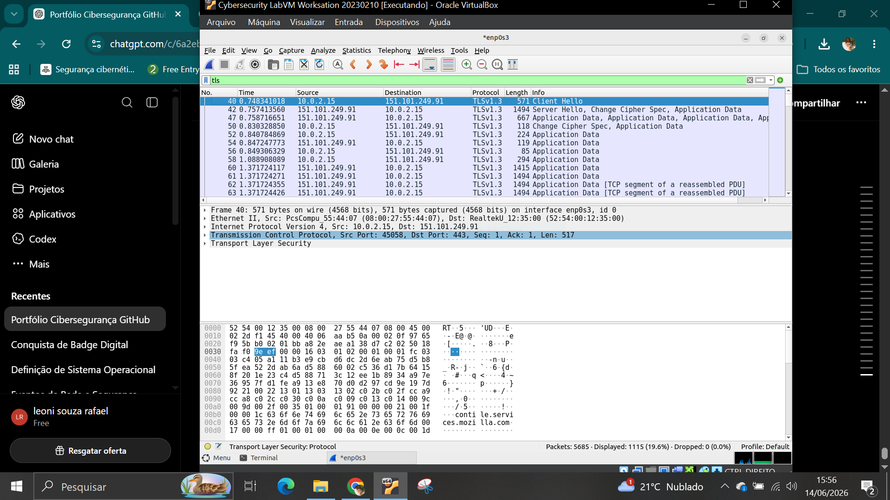

# 🧪 LAB 02 – Traffic Analysis with Wireshark

## 🎯 Objetivo

Capturar e analisar tráfego de rede utilizando o Wireshark para identificar protocolos essenciais utilizados na comunicação entre dispositivos.

## 🛠️ Ferramentas utilizadas

- Wireshark
- Linux

## 📡 Protocolos analisados

- ICMP
- ARP
- DNS
- HTTPS/TLS
  
## 💻 Atividades realizadas

### ICMP

Comando executado prompt comando:

```bash
ping -c 4 8.8.8.8
```

Foram observados pacotes Echo Request e Echo Reply utilizados para validar a conectividade.



---

### ARP
```bash
arp -a
```
Foram capturadas requisições e respostas ARP utilizadas para resolução de endereços IP em endereços MAC.



---

### DNS
```bash
nslookup google.com
host google.com
```
Foi realizada uma consulta DNS para observar a resolução de nomes de domínio.



---

### HTTPS/TLS
```bash
https://www.cisco.com
```
Foi acessado um site utilizando HTTPS para observar o estabelecimento de uma conexão segura utilizando TLS.



O laboratório permitiu compreender o funcionamento dos principais protocolos observados em redes corporativas e demonstrou a utilização do Wireshark para análise de tráfego.
