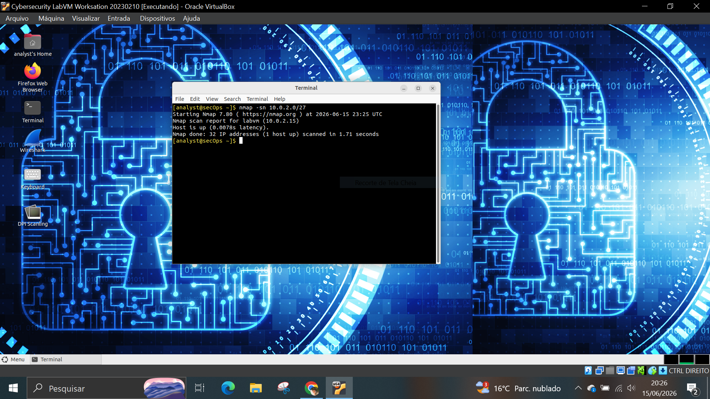
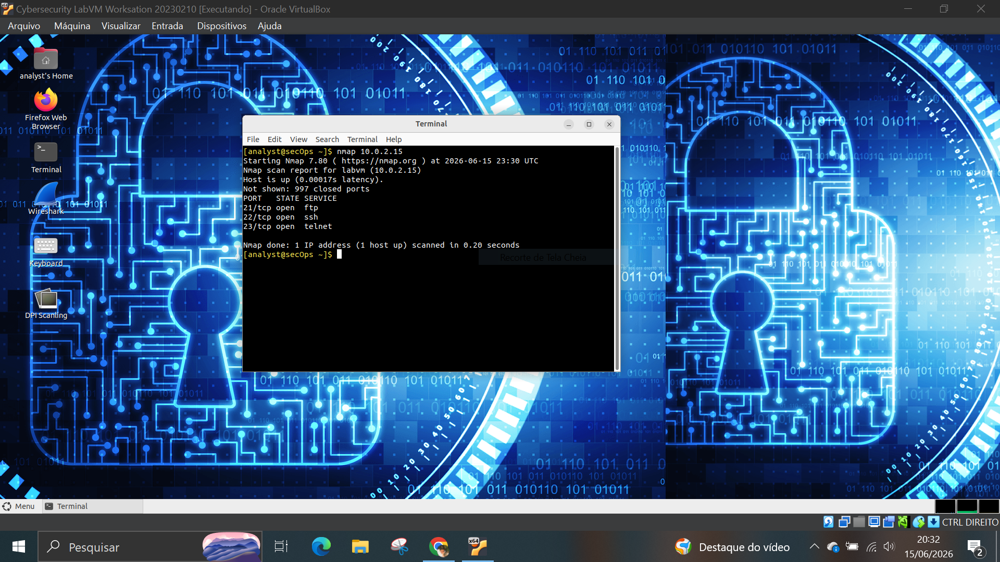
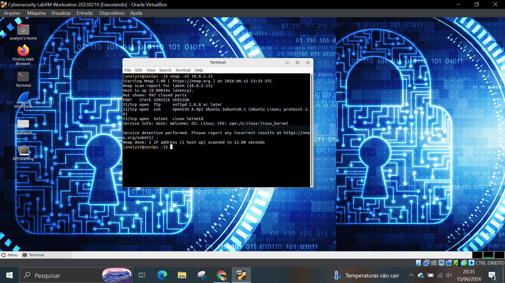
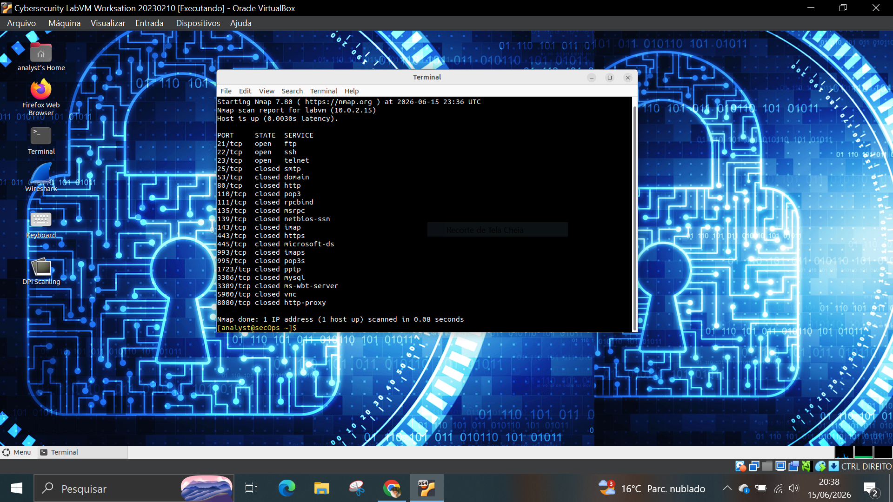

# 🧪 LAB 03 – Descoberta de Rede com Nmap

## 🎯 Objetivo

Utilizar o Nmap para identificar hosts ativos, portas abertas e serviços em execução em um ambiente Linux.

## 🛠️ Ferramentas utilizadas

- Nmap 7.80
- Ubuntu Linux

## 📋 Atividades realizadas

### 1. Descoberta de Hosts

Comando executado:

```bash
nmap -sn 10.0.2.0/27
```

Resultado:

Foi identificado um host ativo na rede virtual utilizada para o laboratório.



---

### 2. Varredura Básica de Portas

Comando executado:

```bash
nmap 10.0.2.15
```

Resultado:

```text
21/tcp open ftp
22/tcp open ssh
23/tcp open telnet
```

Foram encontradas 3 portas abertas e 997 portas fechadas.



---

### 3. Identificação de Serviços

Comando executado:

```bash
nmap -sV 10.0.2.15
```

Resultado:

```text
FTP    -> vsftpd 2.0.8 ou superior
SSH    -> OpenSSH 8.9p1
Telnet -> Linux telnetd
```

O Nmap também identificou o sistema operacional Linux.



---

### 4. Verificação das Portas Mais Comuns

Comando executado:

```bash
nmap --top-ports 20 10.0.2.15
```

Resultado:

Portas abertas:

```text
21/tcp
22/tcp
23/tcp
```

Portas comuns como HTTP (80), HTTPS (443), MySQL (3306) e RDP (3389) estavam fechadas.



---

## 🧠 Análise SOC

Durante a enumeração foram identificados três serviços ativos:

- FTP (21)
- SSH (22)
- Telnet (23)

O SSH é amplamente utilizado para administração remota segura.

O FTP merece atenção por não utilizar criptografia por padrão.

O Telnet é considerado um protocolo legado e transmite informações em texto puro, representando um possível risco de segurança.

A ausência de serviços web e banco de dados reduz a superfície de ataque da máquina.

## 📌 Conclusão

O laboratório demonstrou como utilizar o Nmap para descoberta de hosts, identificação de portas abertas e enumeração de serviços. Essas atividades são fundamentais para analistas de segurança realizarem reconhecimento e avaliação inicial de ambientes de rede.
