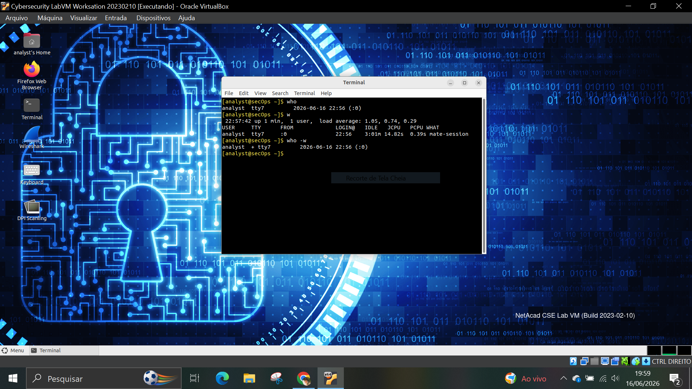
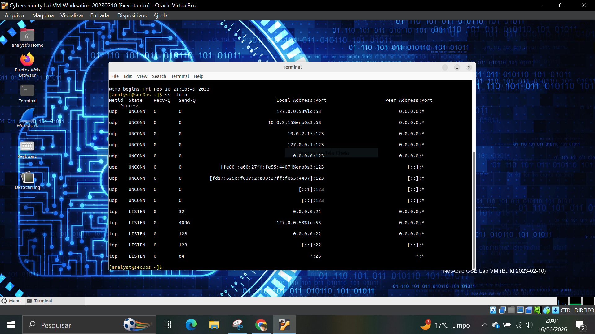
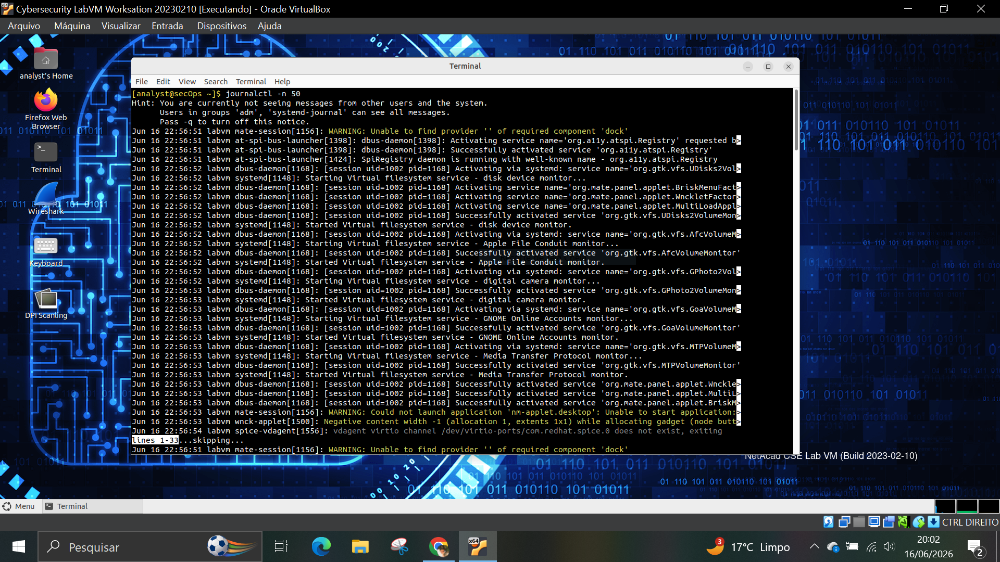
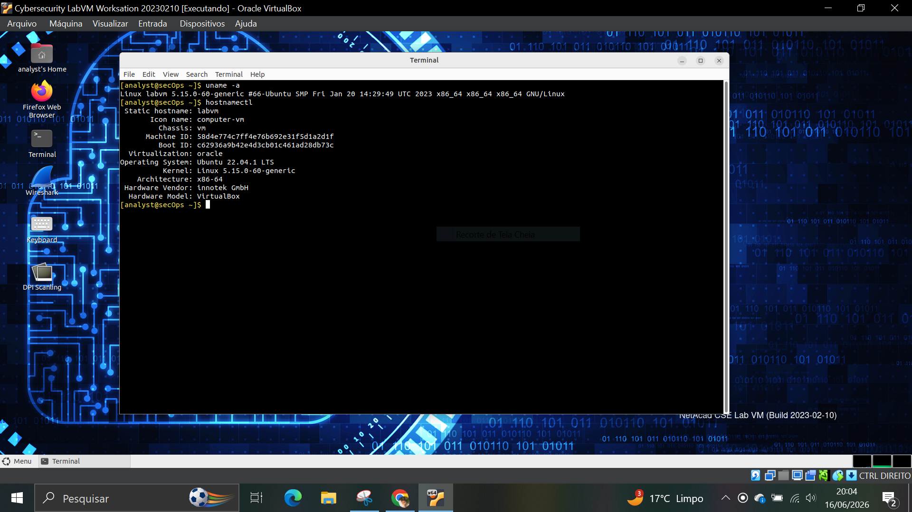

# 🧪 LAB 04 – Linux Log Analysis

## 🎯 Objetivo

Investigar informações do sistema Linux utilizando comandos de consulta de usuários, logs e serviços em execução.

## 🛠️ Ferramentas utilizadas

- Linux
- Terminal Bash

## 📋 Atividades realizadas

### 1. Usuários Conectados

Comandos executados:

```bash
who
w
```

Os comandos permitiram visualizar usuários conectados e informações sobre sessões ativas.



---

### 2. Histórico de Logins

Comando executado:

```bash
last
```

Foi analisado o histórico de acessos registrados no sistema.


---

### 3. Portas e Serviços Ativos

Comando executado:

```bash
ss -tuln
```

Foram identificadas portas em estado de escuta e serviços disponíveis no host.



---

### 4. Logs Recentes do Sistema

Comando executado:

```bash
journalctl -n 50
```

Foram analisados os últimos eventos registrados pelo sistema operacional.



---

### 5. Informações do Sistema

Comandos executados:

```bash
uname -a
hostnamectl
```

Foi realizada a identificação do sistema operacional e das características do host.



---

## 🧠 Análise SOC

A análise de logs é uma das atividades mais importantes em um Centro de Operações de Segurança (SOC).

Por meio dos comandos executados foi possível:

- Verificar usuários conectados.
- Consultar histórico de acessos.
- Identificar serviços expostos.
- Analisar eventos recentes do sistema.
- Coletar informações do host.

Essas informações auxiliam na identificação de atividades suspeitas e na investigação de incidentes.

## 📌 Conclusão

O laboratório demonstrou técnicas básicas de coleta e análise de informações em sistemas Linux, atividade fundamental para monitoramento, investigação e resposta a incidentes de segurança.
