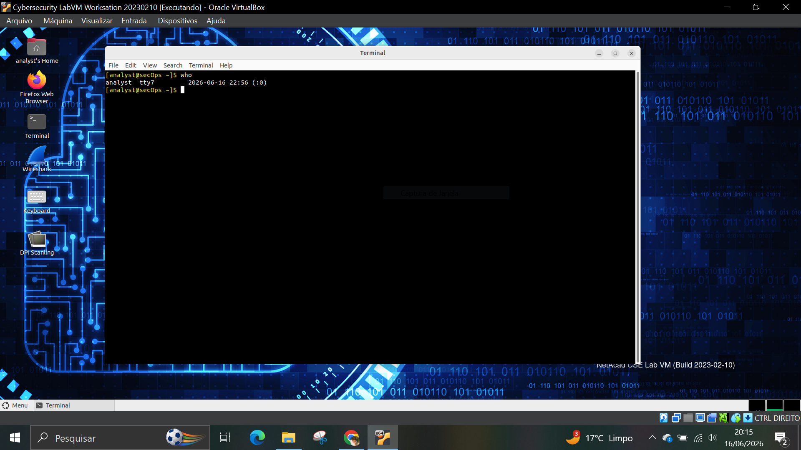
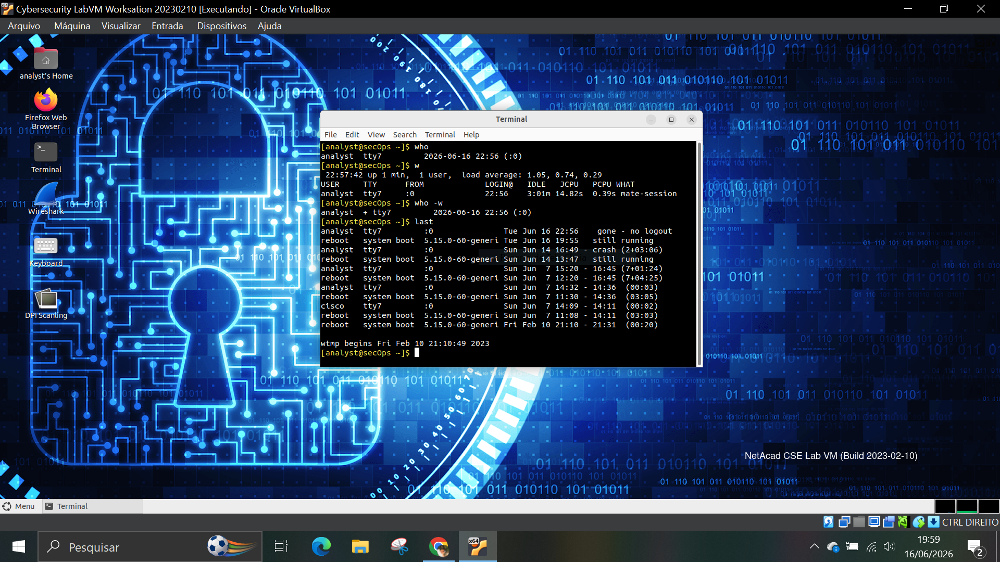
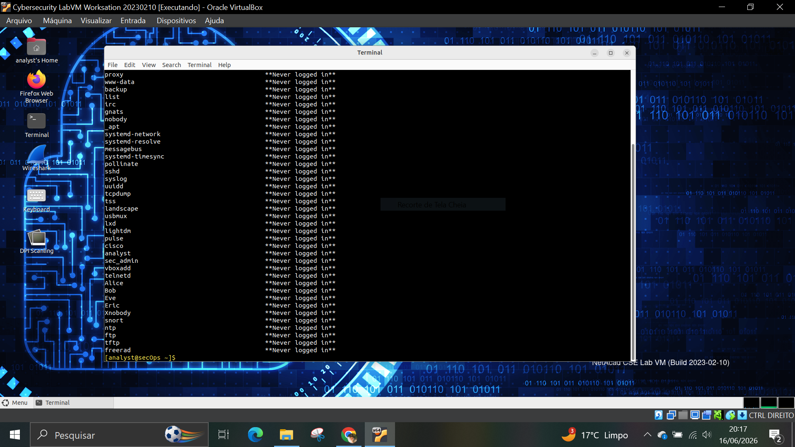
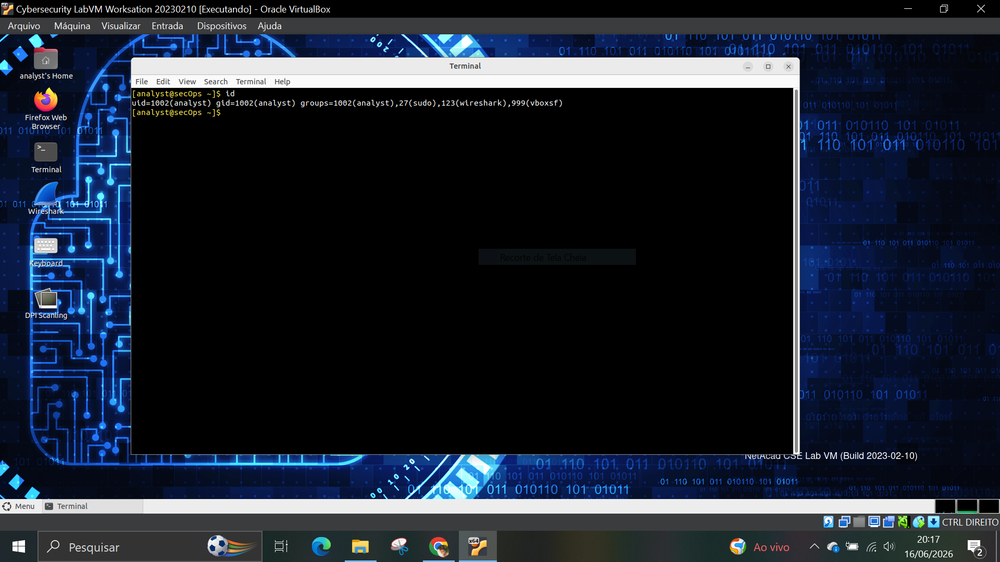
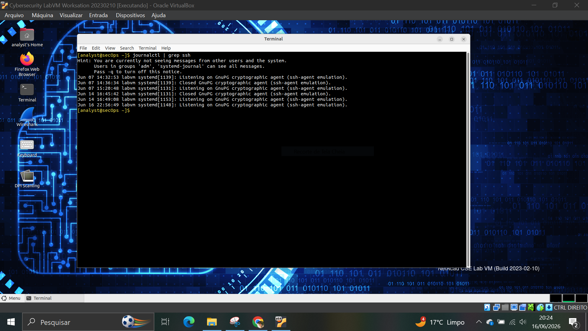

# 🧪 LAB 05 – Authentication Investigation

## 🎯 Objetivo

Investigar eventos de autenticação e acesso em um sistema Linux utilizando ferramentas nativas de consulta de usuários e logs.

## 🛠️ Ferramentas utilizadas

* Linux
* Terminal Bash
* journalctl

## 📋 Atividades realizadas

### 1. Usuários conectados

Comandos executados:

```bash
who
w
```

Foram identificados os usuários atualmente conectados ao sistema e informações sobre suas sessões.



---

### 2. Histórico de logins

Comando executado:

```bash
last
```

Foi consultado o histórico de acessos registrados no sistema.



---

### 3. Último login dos usuários

Comando executado:

```bash
lastlog
```

Foi verificada a data do último acesso de cada usuário registrado.



---

### 4. Informações do usuário atual

Comando executado:

```bash
id
```

Foram obtidas informações sobre o usuário atual, grupos e identificadores.



---

### 5. Eventos relacionados à autenticação

Comando executado:

```bash
journalctl | grep ssh
```

A análise retornou eventos relacionados ao ssh-agent (GnuPG cryptographic agent), responsável pelo gerenciamento de chaves SSH.

Não foram identificados eventos explícitos de autenticação SSH durante a consulta realizada com privilégios limitados.



---

## 🧠 Análise SOC

A investigação de autenticação é uma atividade fundamental em operações de segurança.

Durante o laboratório foi possível:

* Identificar usuários conectados.
* Consultar histórico de acessos.
* Verificar o último login dos usuários.
* Obter informações sobre contas e grupos.
* Analisar eventos relacionados ao ambiente SSH.

Essas informações auxiliam na identificação de acessos suspeitos e na investigação de incidentes de segurança.

## 📌 Conclusão

O laboratório demonstrou técnicas básicas de investigação de autenticação em sistemas Linux. A coleta e análise desses registros permitem que analistas de segurança monitorem atividades de usuários e identifiquem comportamentos anormais no ambiente.

