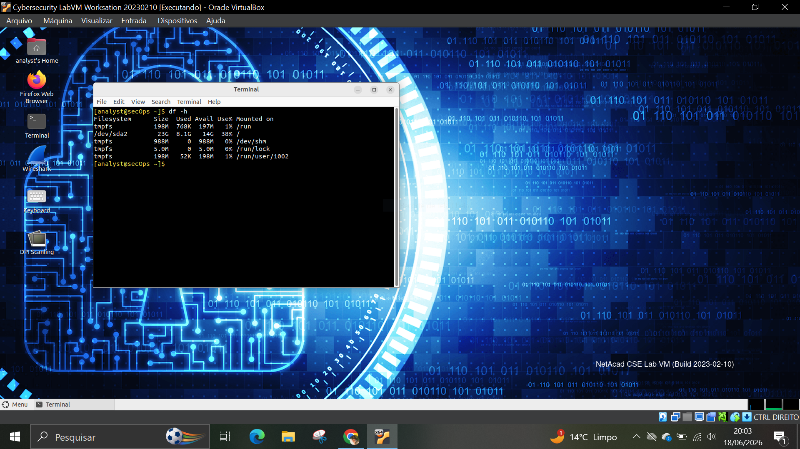

# 🧪 LAB 06 – IOC Investigation

## 🎯 Objetivo

Identificar possíveis Indicadores de Comprometimento (IOCs) em um sistema Linux por meio da análise de usuários, processos, serviços, arquivos recentes e utilização de disco.

## 🛠️ Ferramentas utilizadas

* Linux
* Terminal Bash

## 📋 Atividades realizadas

### 1. Análise de Usuários

Comando executado:

```bash
cat /etc/passwd
```

Foram identificadas as contas existentes no sistema para verificar a presença de usuários não autorizados ou suspeitos.


---

### 2. Análise de Processos

Comando executado:

```bash
ps aux
```

Foram analisados os processos em execução para identificar atividades incomuns ou aplicações desconhecidas.


---

### 3. Serviços e Portas Ativas

Comando executado:

```bash
ss -tuln
```

Foram verificadas as portas abertas e os serviços em estado de escuta na máquina.


---

### 4. Arquivos Modificados Recentemente

Comando executado:

```bash
find /home -type f -mtime -7
```

Foram identificados arquivos modificados nos últimos sete dias para auxiliar na busca por alterações suspeitas.


---

### 5. Utilização de Disco

Comando executado:

```bash
df -h
```

Foi analisada a utilização do armazenamento do sistema para identificar possíveis consumos anormais de espaço.



---

## 🧠 Análise SOC

Indicadores de Comprometimento (IOCs) são evidências que podem sugerir a presença de atividades maliciosas em um sistema.

Durante este laboratório foram analisados:

* Usuários existentes no sistema.
* Processos em execução.
* Serviços ativos e portas abertas.
* Arquivos alterados recentemente.
* Utilização de armazenamento.

Essas verificações ajudam analistas de segurança a identificar comportamentos anormais e possíveis sinais de comprometimento.

## 📌 Conclusão

O laboratório demonstrou técnicas básicas de IOC Investigation em sistemas Linux. A análise de usuários, processos, serviços e arquivos fornece informações importantes para atividades de monitoramento, investigação e resposta a incidentes de segurança.

