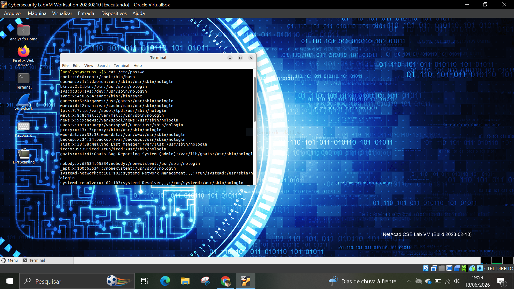
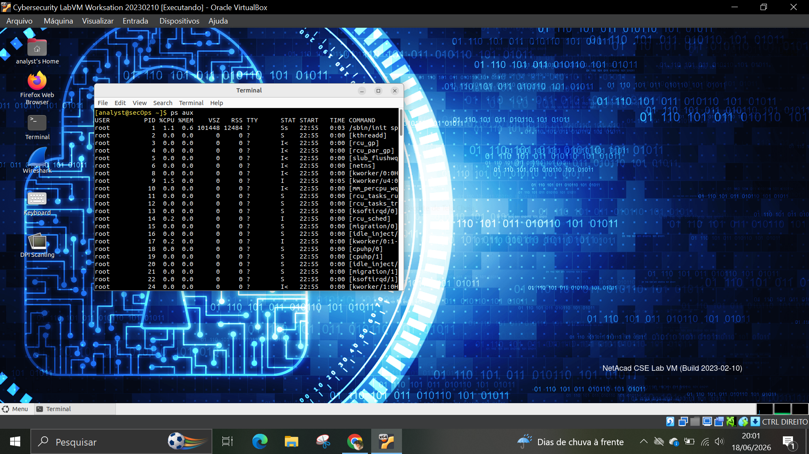
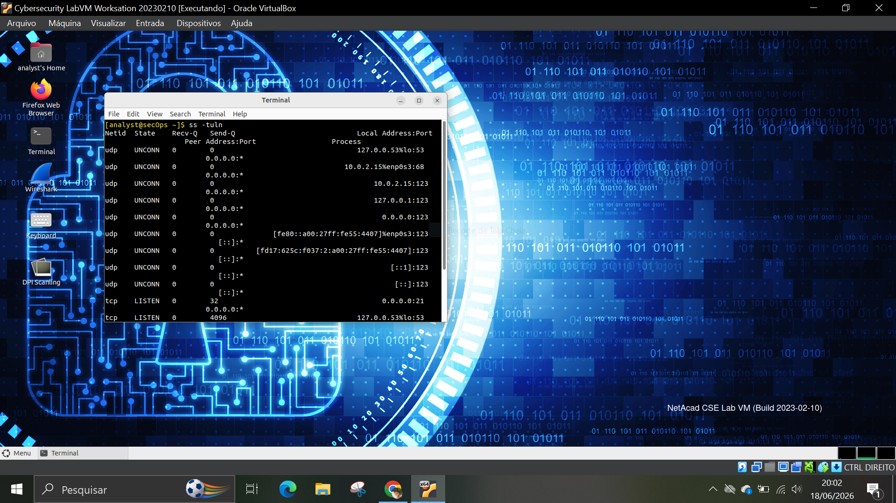
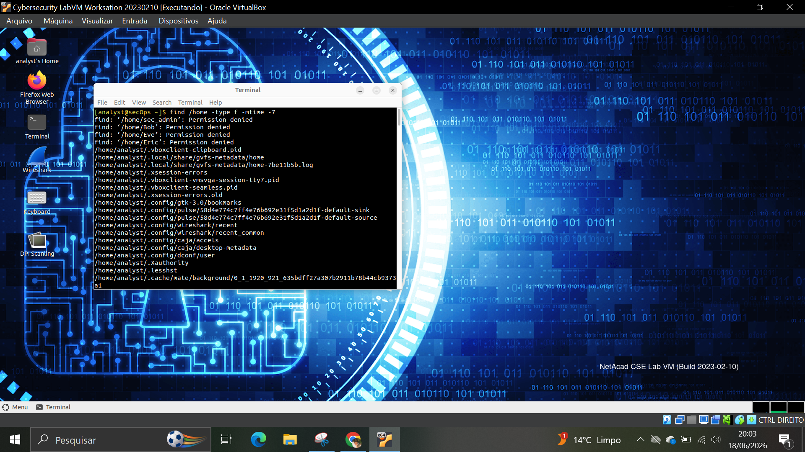

# 🧪 LAB 06 – IOC Investigation

## 🎯 Objetivo

Identificar possíveis Indicadores de Comprometimento (IOCs) em um sistema Linux por meio da análise de usuários, processos, serviços, arquivos recentes e utilização de disco.

## 🛠️ Ferramentas utilizadas

- Linux
- Terminal Bash

## 📋 Atividades realizadas

### 1. Análise de Usuários

Comando executado:

```bash
cat /etc/passwd
```

Foram identificadas as contas existentes no sistema.



---

### 2. Análise de Processos

Comando executado:

```bash
ps aux
```

Foram verificados os processos em execução para identificar possíveis atividades incomuns.



---

### 3. Serviços e Portas Ativas

Comando executado:

```bash
ss -tuln
```

Foram analisadas as portas abertas e os serviços em escuta.



---

### 4. Arquivos Modificados Recentemente

Comando executado:

```bash
find /home -type f -mtime -7
```

Foram identificados arquivos modificados nos últimos sete dias.



---

### 5. Utilização de Disco

Comando executado:

```bash
df -h
```

Foi analisada a utilização de armazenamento do sistema.


---

## 🧠 Análise SOC

Durante a investigação foram analisados possíveis Indicadores de Comprometimento (IOCs), incluindo usuários existentes, processos ativos, serviços em execução, alterações recentes em arquivos e utilização de armazenamento.

A identificação desses elementos auxilia na detecção de atividades suspeitas e na investigação de incidentes de segurança.

## 📌 Conclusão

O laboratório demonstrou técnicas básicas de Threat Hunting e IOC Investigation em sistemas Linux, permitindo a identificação de evidências que podem indicar comprometimento ou comportamento anômalo.
